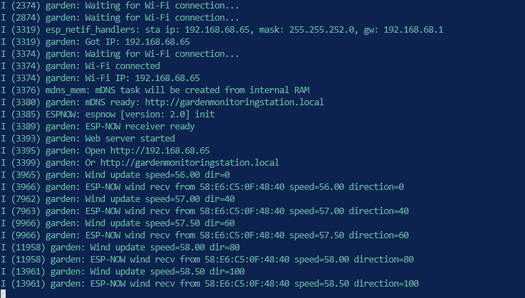

# Garden Monitoring Station

ESP32-C6 project using ESP-IDF with Arduino as a component.

This project does two main things:
- connects to Wi-Fi and serves a small web dashboard
- receives sensor data over ESP-NOW and exposes the latest values through `/v1/data/`

## Features

- Web dashboard served directly from the ESP32
- JSON endpoint at `/v1/data/`
- mDNS hostname: `http://gardenmonitoringstation.local`
- ESP-NOW receiver support for humidity, rainfall and wind data sensor nodes
- NTP clock sync after Wi-Fi connects, used for per-sensor received timestamps
- Current sensor handling for:
  - wind speed in `m/s`
  - wind direction
  - humidity
  - rainfall

## Project Layout

- `main/esp32_webserver.cpp` main application
- `main/app.js` dashboard JavaScript source
- `main/app.css` dashboard CSS source
- `main/index.html` dashboard HTML source
- `main/config.h` local Wi-Fi config, ignored by Git
- `main/idf_component.yml` component dependencies
- `CMakeLists.txt` project build config

The firmware currently serves the HTML, CSS and JavaScript from `PROGMEM` strings inside `main/esp32_webserver.cpp`.

## Requirements

- ESP-IDF `v5.5.4`
- ESP32-C6 board
- Arduino-ESP32 as an ESP-IDF component
- Wi-Fi access with internet access for public NTP servers, unless you change `configTime(...)` to use a local NTP server

## Local Config

Create `main/config.h` with your Wi-Fi details:

```cpp
#pragma once

constexpr char kWifiSsid[] = "your-wifi-name";
constexpr char kWifiPassword[] = "your-wifi-password";
```

`main/config.h` is ignored by Git so credentials are not committed.

## Build

Open an ESP-IDF terminal in the project folder and run:

```powershell
idf.py build
```

Flash and monitor:

```powershell
idf.py -p COM4 flash monitor
```

## Web Access

After boot, the device logs its IP and mDNS name.

Open either:

- `http://gardenmonitoringstation.local`
- `http://<device-ip>/`

JSON endpoint:

- `http://gardenmonitoringstation.local/v1/data/`
- `http://<device-ip>/v1/data/`

Example response:

```json
{
  "device": "esp32c6",
  "ip": "192.168.1.23",
  "rssi": -50,
  "uptime_ms": 123456,
  "humidity": null,
  "humidityReceived": null,
  "windSpeed": 2.4,
  "windDirection": 180,
  "windDataReceived": 1777112345,
  "rain": null,
  "rainReceived": null
}
```

Each `...Received` field is a Unix timestamp in seconds. If a sensor has not reported yet, that sensor's value and timestamp are returned as `null`.

## ESP-NOW

This device acts as an ESP-NOW receiver.

Sensor nodes send packets with a sensor ID and two float values. The receiver updates the latest sensor state and the web page fetches that data from `/v1/data/`.

Packet structure:

```cpp
struct SensorPacket {
    uint8_t sensorId;
    float value1;
    float value2;
};
```

Current sensor ID mapping:

- `1` rainfall
- `2` wind
- `3` humidity

Current value mapping:

- Rainfall: `value1` is rainfall in `mm`
- Wind: `value1` is wind speed in `m/s`, `value2` is wind direction in degrees
- Humidity: `value1` is relative humidity percentage

Make sure sender and receiver use the exact same packet structure.

## Notes



- `managed_components/`, `build/`, and `sdkconfig` are ignored in Git
- `main/config.h` is ignored in Git
- if `.local` does not resolve on your PC, use the direct IP address
